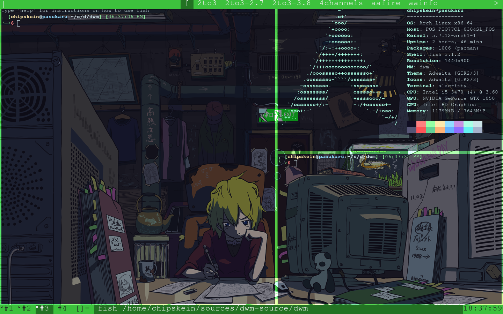

# dwm-config
my dwm config
<!DOCTYPE html>
<html >
<head>
</head>
<body>
    
    <h2>codesource: https://git.suckless.org/dwm</h2>
    <h1>Keyboard shortcuts<h1>
    <pre>
       ModKey=Super key L
       mod+shiftL+enter= terminal(alacritty)
       mod+p=dmenu
       mod+shiftL+q=quit
       mod+num[1,2,3,4]=change to tag num   
       mod+shift+c=close window
       mod+enter=change selected window
       mod+j=next window
       mod+k=previus window
       mod+t= change to title layout
       mot+m=change to monocle layout
       mod+f=change to floating layout
       mod+space=toggle layouts
       mod+i=increment master windows
       mod-d=decrement master windows
       mod-l=master size left++
       mod-h=master size left--
       mod+shiftL+num[1,2,3,4]=apply tag to a window
       mod+tab=toggle tags                
</body>
</html>
